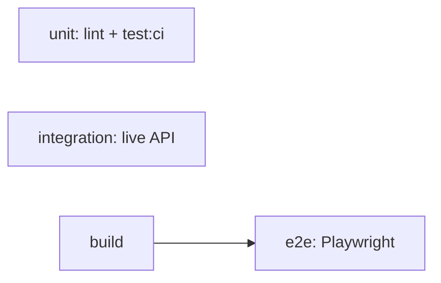

# Testing

Automated test suites live under [`tests/`](../tests/) at the repo root.

## Layout

| Layer | Path | Runner | Network |
|-------|------|--------|---------|
| Unit | `tests/unit/` | Vitest + jsdom | Mocked |
| Integration | `tests/integration/` | Vitest (node) | Live Render API |
| E2E | `tests/e2e/` | Playwright | Static `out/` + live API |

## Quick commands

```bash
pnpm test              # unit watch mode
pnpm test:ci           # unit (CI)
pnpm test:integration  # live API (skipped locally without secrets)
pnpm test:e2e          # build + Playwright against out/
pnpm test:all          # unit → integration → e2e
pnpm verify            # lint + unit + build (fast PR gate)
```

## Unit tests

Fast, no network. Covers:

- `lib/api/*` — client, auth, mappers, slots, orders, services, media, users, memberships, **assistant**
- `lib/account/*` — order filters, tab parsing
- `lib/utils`, `lib/build-info`
- `hooks/useSectionNav`
- Components: AuthModal, BookingWizard, Carousel, Navbar, HashScrollHandler

## Integration tests (live API)

Hit the production Render API (`https://car-wash-vbry.onrender.com/api` by default).

**GitHub secrets required:**

| Secret | Purpose |
|--------|---------|
| `WOOSH_TEST_PHONE` | 10-digit Indian test number |
| `WOOSH_TEST_OTP` | Fixed/bypass OTP for that number |
| `NEXT_PUBLIC_API_BASE_URL` | Optional API override |

If `WOOSH_TEST_PHONE` / `WOOSH_TEST_OTP` are unset, integration suites are **skipped** (not failed).

Test orders use addresses prefixed with `WOOSH_CI_TEST` for identification.

Config: [`vitest.integration.config.ts`](../vitest.integration.config.ts) — 120s timeout, 2 retries for cold starts.

## AI assistant (local two-service setup)

The chat widget calls a **separate** FastAPI service (`woosh-ai-assistant`), not the static Next.js export.

```bash
# Terminal 1 — assistant (sibling repo)
cd ../woosh-ai-assistant
cp .env.example .env
# Set WOOSH_USE_MOCK_BACKEND=false and WOOSH_BACKEND_BASE_URL for live API
uvicorn app.main:app --reload --port 8000

# Terminal 2 — website
cd woosh-website
# .env: NEXT_PUBLIC_ASSISTANT_API_URL=http://localhost:8000
pnpm dev:clean
```

Ensure `ALLOWED_ORIGINS` in the assistant includes `http://localhost:3000` (and preview/prod domains when deployed).

**Deploy:** host the assistant on Render/Railway/Fly (port 8000), then set `NEXT_PUBLIC_ASSISTANT_API_URL` on Vercel preview/production.

Unit: [`tests/unit/lib/api/assistant.test.ts`](../tests/unit/lib/api/assistant.test.ts)<br />
E2E: [`tests/e2e/specs/assistant.spec.ts`](../tests/e2e/specs/assistant.spec.ts) — mocks `POST /chat` unless `ASSISTANT_URL` is set in CI.

## E2E tests (Playwright)

1. `pnpm build` exports static site to `out/`
2. `serve` serves `out/` on port 4173
3. Playwright runs specs mirroring [`REGRESSION_CHECKLIST.md`](./REGRESSION_CHECKLIST.md)

Auth-dependent flows use `tests/e2e/fixtures/auth.setup.ts` to log in once and persist session storage. Same secrets as integration tests.

Projects run at **390px** (Pixel 5), **768px** (iPad Mini), and **1280px** (desktop).

**Account routes:** `/account` is the signed-in hub (overview, orders, Woosh Coins, referral). `/orders` redirects to `/account?tab=orders`. E2E specs: `tests/e2e/specs/account.spec.ts`, `orders.spec.ts`.

## CI jobs



| Job | When | Notes |
|-----|------|-------|
| `unit` | Every PR | Required |
| `build` | Every PR | Required |
| `integration` | Every PR | `continue-on-error` until secrets configured |
| `e2e` | After build | `continue-on-error`; uploads trace on failure |

## Obtaining test OTP

Coordinate with the backend/API owner for a dedicated test number and bypass OTP. Do not use real customer numbers in CI.

## Local E2E tips

```bash
# One-time browser install
pnpm exec playwright install chromium

# Run only no-auth specs (no secrets needed)
pnpm build && pnpm exec playwright test --grep @no-auth

# With secrets
$env:WOOSH_TEST_PHONE="9876543210"
$env:WOOSH_TEST_OTP="123456"
pnpm test:e2e
```
